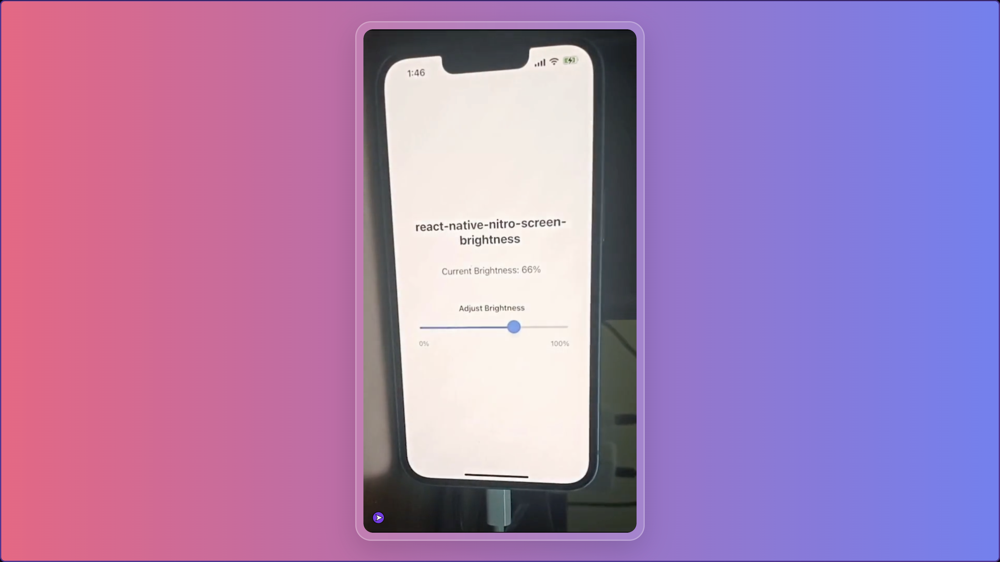

# react-native-nitro-screen-brightness

A high-performance React Native library for controlling screen brightness, built with [Nitro Modules](https://nitro.margelo.com/) for native performance.

Currently, this is the only react-native package targetting screen brightness that

1. Supports the new architecture
2. Supports apps outside the Expo ecosystem.

## Features

- 🚀 **High Performance** - Built with Nitro Modules for optimal native performance
- 📱 **Cross-Platform** - Works on both iOS and Android
- 🎯 **Type-Safe** - Full TypeScript support with comprehensive type definitions
- 🔧 **Simple API** - Easy-to-use functions for brightness control
- ⚡ **Real-Time Updates** - Instant brightness changes without lag

## Installation

```sh
npm install react-native-nitro-screen-brightness react-native-nitro-modules
```

or with yarn:

```sh
yarn add react-native-nitro-screen-brightness react-native-nitro-modules
```

> **Note:** `react-native-nitro-modules` is required as this library relies on [Nitro Modules](https://nitro.margelo.com/).

### iOS Setup

```sh
cd ios && pod install
```

### Android Setup

No additional setup required for Android.

## Usage

```typescript
import {
  getBrightness,
  setBrightness,
  getSystemBrightness,
} from 'react-native-nitro-screen-brightness';

// Get current app brightness (0.0 - 1.0)
const currentBrightness = getBrightness();
console.log('Current brightness:', currentBrightness);

// Set app brightness (0.0 = darkest, 1.0 = brightest)
setBrightness(0.8);

// Get system brightness (0.0 - 1.0)
// On Android: Returns system-wide brightness setting
// On iOS: Returns same as getBrightness() (iOS doesn't distinguish)
const systemBrightness = getSystemBrightness();
console.log('System brightness:', systemBrightness);
```

## Demo

Threads Pull-to-refresh
[](https://github.com/adithyavis/react-native-nitro-screen-brightness/blob/main/assets/react-native-nitro-screen-brightness.mp4)

## Contributing

- [Development workflow](CONTRIBUTING.md#development-workflow)
- [Sending a pull request](CONTRIBUTING.md#sending-a-pull-request)
- [Code of conduct](CODE_OF_CONDUCT.md)

## License

MIT

---

Made with [create-react-native-library](https://github.com/callstack/react-native-builder-bob)

## Hire me

[Adithya Viswamithiran](https://bit.ly/3qSe5BN)

Also refer to some of my work

- [reanimated-tab-view: A custom tab view component for react-native built using reanimated](https://github.com/adithyavis/reanimated-tab-view)
